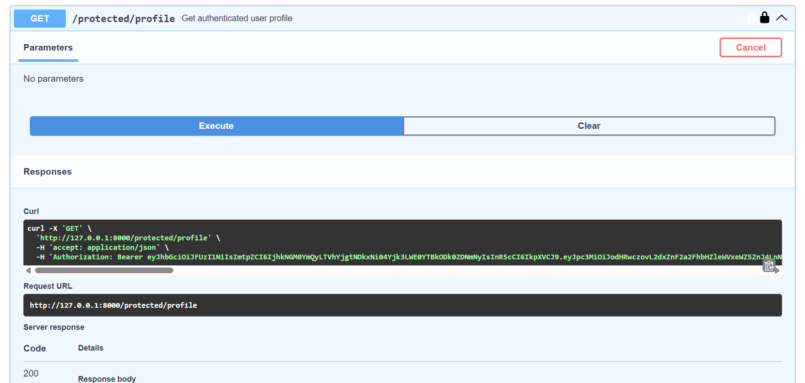
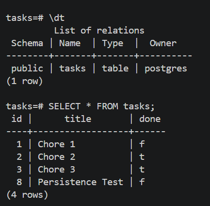

# Task API — FastAPI + PostgreSQL + Docker + Authentication

A simple backend API for managing tasks, built with **FastAPI** and **PostgreSQL**.

This project started as a basic FastAPI CRUD API using SQLite. It was later migrated to PostgreSQL and containerized using **Docker** and **Docker Compose**.

The project was then extended with **Supabase-based authentication**, including Bearer token authentication and a protected API route.

The complete application stack can be started with:

```cmd
docker compose up
```

The project currently demonstrates:

* FastAPI API development
* CRUD operations
* PostgreSQL database integration
* Docker containerization
* Docker Compose
* Persistent Docker volumes
* Environment variable configuration
* Parameterized SQL queries
* Supabase authentication
* Bearer token authentication
* Protected API routes
* Swagger UI authentication and testing

---

# Project Overview

The application consists of two main services:

1. **FastAPI API**
2. **PostgreSQL Database**

Authentication is handled using Supabase.

The overall architecture is:

```text
                        Client / Swagger UI
                                │
                                │ HTTP Request
                                ▼
                        ┌───────────────┐
                        │    FastAPI    │
                        │      API      │
                        └───────┬───────┘
                                │
                 ┌──────────────┴──────────────┐
                 │                             │
                 ▼                             ▼
        ┌─────────────────┐           ┌─────────────────┐
        │   PostgreSQL    │           │    Supabase     │
        │    Database     │           │ Authentication  │
        └────────┬────────┘           └─────────────────┘
                 │
                 ▼
          taskdata volume
```

Docker Compose manages the FastAPI and PostgreSQL services.

Supabase provides user authentication and access tokens.

---

# Technologies Used

The project uses the following technologies:

* **Python**
* **FastAPI**
* **PostgreSQL**
* **psycopg**
* **Docker**
* **Docker Compose**
* **Supabase**
* **Swagger UI**
* **Pydantic**
* **python-dotenv**

---

# Project Development

The project was developed in multiple stages.

The initial version was a simple FastAPI application with CRUD functionality.

The project then progressed through the following stages:

```text
FastAPI
   │
   ▼
SQLite Database
   │
   ▼
PostgreSQL Migration
   │
   ▼
Docker Containerization
   │
   ▼
Docker Compose
   │
   ▼
Environment Variables
   │
   ▼
Database Persistence
   │
   ▼
Supabase Authentication
   │
   ▼
Bearer Token Authentication
   │
   ▼
Protected API Routes
```

---

# Initial FastAPI Setup

At the beginning of the project, a Python virtual environment was created.

## Create a Virtual Environment

```cmd
python -m venv venv
```

## Activate the Virtual Environment

On Windows Command Prompt:

```cmd
venv\Scripts\activate.bat
```

When the virtual environment is active, the terminal prompt begins with:

```text
(venv)
```

## Install Dependencies

Dependencies can be installed using:

```cmd
pip install -r requirements.txt
```

The FastAPI application can then be run locally during development.

---

# Docker and PostgreSQL Setup

The project uses Docker Compose to run two services together:

1. **FastAPI API**
2. **PostgreSQL Database**

The Docker architecture looks like this:

```text
                         Docker Compose
                               │
                 ┌─────────────┴─────────────┐
                 │                           │
                 ▼                           ▼
        ┌────────────────┐          ┌────────────────┐
        │    FastAPI     │          │   PostgreSQL   │
        │      API       │◄────────►│    Database    │
        │                │          │                │
        │ taskapi-compose│          │ taskdb-compose │
        └────────────────┘          └───────┬────────┘
                                            │
                                            ▼
                                      taskdata volume
```

Docker Compose automatically creates a network that allows the FastAPI container to communicate with the PostgreSQL container.

---

# Docker Compose Services

The project contains two services.

## PostgreSQL Service

The PostgreSQL service is named:

```text
db
```

It uses the PostgreSQL Docker image:

```text
postgres:17
```

The container is named:

```text
taskdb-compose
```

The database configuration is supplied through environment variables.

---

## FastAPI Service

The FastAPI service builds the application using the project's `Dockerfile`.

The container is named:

```text
taskapi-compose
```

The API exposes port:

```text
8000
```

Therefore, the application can be accessed from the host machine at:

```text
http://127.0.0.1:8000
```

---

# Docker Networking

Inside Docker Compose, the FastAPI application connects to PostgreSQL using:

```text
POSTGRES_HOST=db
```

Here:

```text
db
```

is the name of the PostgreSQL service.

Inside Docker Compose, the API does **not** connect to PostgreSQL using:

```text
localhost
```

Instead, the connection works like this:

```text
FastAPI Container
       │
       │ POSTGRES_HOST=db
       ▼
Docker Compose Network
       │
       ▼
PostgreSQL Container
```

Docker automatically resolves the service name `db` to the PostgreSQL container.

---

# Environment Variables

The project uses environment variables for configuration.

The local configuration is stored in:

```text
.env
```

The `.env` file is ignored by Git.

The `.gitignore` file contains:

```text
__pycache__
venv
tasks.db
.env
```

This prevents sensitive configuration from being committed to GitHub.

---

# Environment Configuration Template

A safe template is provided through:

```text
.env.example
```

The current environment variable template contains:

```text
POSTGRES_HOST=localhost
POSTGRES_DB=tasks
POSTGRES_USER=postgres
POSTGRES_PASSWORD=your_postgres_password

SUPABASE_URL=your_project_url
SUPABASE_KEY=your_publishable_key
```

The `.env.example` file can safely be committed to GitHub because it does not contain real credentials.

---

# Why Use Environment Variables?

Sensitive values such as database passwords and authentication configuration should not be hardcoded into the source code.

For example:

```text
POSTGRES_PASSWORD
```

is stored in the `.env` file.

Docker Compose reads the value using:

```yaml
POSTGRES_PASSWORD: ${POSTGRES_PASSWORD}
```

Docker Compose replaces:

```text
${POSTGRES_PASSWORD}
```

with the actual value from the `.env` file.

This keeps sensitive configuration separate from the application code.

The same approach is used for:

```text
POSTGRES_HOST
POSTGRES_DB
POSTGRES_USER
POSTGRES_PASSWORD
SUPABASE_URL
SUPABASE_KEY
```

---

# Running the Project with Docker

Make sure Docker Desktop is running.

From the project directory, start the complete application:

```cmd
docker compose up
```

Docker Compose will:

1. Start PostgreSQL.
2. Create or connect to the PostgreSQL volume.
3. Build the FastAPI image.
4. Start the FastAPI container.
5. Create the Docker Compose network.
6. Allow the FastAPI container to communicate with PostgreSQL.
7. Load the required environment variables.

---

# Run in Detached Mode

To run the containers in the background:

```cmd
docker compose up -d
```

---

# Check Running Containers

To check the status of the services:

```cmd
docker compose ps
```

The expected containers are:

```text
taskapi-compose
taskdb-compose
```

---

# Accessing the API

Once the application is running, the API is available at:

```text
http://127.0.0.1:8000
```

Swagger UI is available at:

```text
http://127.0.0.1:8000/docs
```

ReDoc is available at:

```text
http://127.0.0.1:8000/redoc
```

Swagger UI provides automatically generated API documentation and allows the API endpoints to be tested directly from the browser.

---

# Why PostgreSQL?

The original version of the project used SQLite.

SQLite is useful for small projects because the database is stored in a local file.

The project was later migrated to PostgreSQL.

PostgreSQL is a separate database server that runs independently from the FastAPI application.

The architecture changed from:

```text
FastAPI
   │
   ▼
SQLite Database File
```

to:

```text
FastAPI Application
        │
        │ Database Connection
        ▼
PostgreSQL Database
```

Using Docker, both components run as separate services:

```text
┌──────────────────┐
│   FastAPI API    │
│                  │
│ taskapi-compose  │
└────────┬─────────┘
         │
         │ Docker Network
         ▼
┌──────────────────┐
│   PostgreSQL     │
│                  │
│ taskdb-compose   │
└────────┬─────────┘
         │
         ▼
   taskdata volume
```

This structure is closer to a real-world backend architecture.

---

# Database Structure

The PostgreSQL database is named:

```text
tasks
```

The application stores task data in a table named:

```text
tasks
```

The table contains the following columns:

| Column  | Type    | Description                     |
| ------- | ------- | ------------------------------- |
| `id`    | INTEGER | Unique identifier for each task |
| `title` | TEXT    | Task title                      |
| `done`  | BOOLEAN | Task completion status          |

Example:

| id | title   | done  |
| -: | ------- | ----- |
|  1 | Chore 1 | false |
|  2 | Chore 2 | true  |
|  3 | Chore 3 | true  |

The application creates the required database structure when necessary.

---

# Database Connection

The FastAPI application connects to PostgreSQL using environment variables.

The application reads:

```text
POSTGRES_HOST
POSTGRES_DB
POSTGRES_USER
POSTGRES_PASSWORD
```

The connection configuration follows this pattern:

```python
host=os.getenv("POSTGRES_HOST")
dbname=os.getenv("POSTGRES_DB")
user=os.getenv("POSTGRES_USER")
password=os.getenv("POSTGRES_PASSWORD")
```

This allows the application to use different database configurations without modifying the Python source code.

For local development:

```text
POSTGRES_HOST=localhost
```

Inside Docker Compose:

```text
POSTGRES_HOST=db
```

The Docker Compose configuration sets:

```yaml
POSTGRES_HOST: db
```

This allows the FastAPI container to communicate with the PostgreSQL service.

---

# Parameterized SQL Queries

The application uses parameterized SQL queries when interacting with PostgreSQL.

For example:

```sql
SELECT * FROM tasks WHERE id = %s;
```

The value is supplied separately instead of directly inserting user input into the SQL query.

This approach is used when retrieving, updating, and deleting task data.

Parameterized queries help protect the application against SQL injection.

---

# PostgreSQL Data Persistence

PostgreSQL data is stored using a named Docker volume.

The project uses:

```text
taskdata
```

The volume is mounted inside the PostgreSQL container at:

```text
/var/lib/postgresql/data
```

The Docker Compose configuration includes:

```yaml
volumes:
  - taskdata:/var/lib/postgresql/data
```

The data flow is:

```text
PostgreSQL Container
        │
        ▼
/var/lib/postgresql/data
        │
        ▼
taskdata Docker Volume
```

Docker containers are temporary.

Without a persistent volume, database data could be lost when the container is removed.

The named Docker volume allows the PostgreSQL data to survive container recreation.

---

# Persistence Test

Database persistence was tested by creating a task:

```json
{
    "id": 8,
    "title": "Persistence Test",
    "done": false
}
```

The Docker Compose stack was stopped using:

```cmd
docker compose down
```

The containers were then started again:

```cmd
docker compose up -d
```

After restarting the containers, the task was requested again:

```cmd
curl -i http://127.0.0.1:8000/tasks/8
```

The API returned:

```text
HTTP/1.1 200 OK
```

with:

```json
{
    "id": 8,
    "title": "Persistence Test",
    "done": false
}
```

This confirmed that the PostgreSQL database data persisted after the Docker Compose containers were stopped and recreated.

---

# API Endpoints

The API provides CRUD functionality for managing tasks.

| Method | Endpoint           | Description              | Success Status |
| ------ | ------------------ | ------------------------ | -------------- |
| GET    | `/tasks`           | Retrieve all tasks       | 200            |
| GET    | `/tasks/{task_id}` | Retrieve a specific task | 200            |
| POST   | `/tasks`           | Create a new task        | 201            |
| PUT    | `/tasks/{task_id}` | Update a task            | 200            |
| DELETE | `/tasks/{task_id}` | Delete a task            | 204            |

CRUD stands for:

```text
Create
Read
Update
Delete
```

---

# Get All Tasks

Retrieve all tasks:

```cmd
curl -i http://127.0.0.1:8000/tasks
```

A successful request returns:

```text
HTTP/1.1 200 OK
```

Example response:

```json
[
    {
        "id": 1,
        "title": "Chore 1",
        "done": false
    },
    {
        "id": 2,
        "title": "Chore 2",
        "done": true
    },
    {
        "id": 3,
        "title": "Chore 3",
        "done": true
    }
]
```

---

# Get a Task by ID

Retrieve a specific task:

```cmd
curl -i http://127.0.0.1:8000/tasks/1
```

A successful request returns:

```text
HTTP/1.1 200 OK
```

Example response:

```json
{
    "id": 1,
    "title": "Chore 1",
    "done": false
}
```

---

# Requesting a Non-Existing Task

If a task does not exist:

```cmd
curl -i http://127.0.0.1:8000/tasks/999
```

The API returns:

```text
HTTP/1.1 404 Not Found
```

---

# Create a Task

Create a new task:

```cmd
curl -i -X POST http://127.0.0.1:8000/tasks -H "Content-Type: application/json" -d "{\"title\":\"New Task\",\"done\":false}"
```

A successful request returns:

```text
HTTP/1.1 201 Created
```

Example response:

```json
{
    "id": 7,
    "title": "New Task",
    "done": false
}
```

> The generated task ID may be different depending on the current state of the database.

---

# Update a Task

Update an existing task:

```cmd
curl -i -X PUT http://127.0.0.1:8000/tasks/1 -H "Content-Type: application/json" -d "{\"title\":\"Updated Task\",\"done\":true}"
```

A successful request returns:

```text
HTTP/1.1 200 OK
```

Example response:

```json
{
    "id": 1,
    "title": "Updated Task",
    "done": true
}
```

---

# Delete a Task

Delete a task:

```cmd
curl -i -X DELETE http://127.0.0.1:8000/tasks/7
```

A successful request returns:

```text
HTTP/1.1 204 No Content
```

After deletion, requesting the same task:

```cmd
curl -i http://127.0.0.1:8000/tasks/7
```

returns:

```text
HTTP/1.1 404 Not Found
```

---

# HTTP Status Codes

The API uses appropriate HTTP status codes.

| Status Code | Meaning    | Used For                        |
| ----------: | ---------- | ------------------------------- |
|         200 | OK         | Successful GET and PUT requests |
|         201 | Created    | Successful POST request         |
|         204 | No Content | Successful DELETE request       |
|         404 | Not Found  | Requested task does not exist   |

---

# Supabase Authentication

The project uses Supabase for authentication.

The following environment variables are used:

```text
SUPABASE_URL
SUPABASE_KEY
```

These values are stored in the local `.env` file.

A safe version is included in `.env.example`:

```text
SUPABASE_URL=your_project_url
SUPABASE_KEY=your_publishable_key
```

The real Supabase credentials are not committed to GitHub.

---

# Bearer Token Authentication

The API uses Bearer token authentication for protected routes.

A client must include an authentication token in the HTTP request.

The request format is:

```text
Authorization: Bearer <access_token>
```

The API reads the Bearer token from the request and uses it to verify the authenticated user.

The authentication flow is:

```text
User
  │
  │ Login / Authentication
  ▼
Supabase
  │
  │ Access Token
  ▼
Client / Swagger UI
  │
  │ Authorization: Bearer <token>
  ▼
FastAPI Protected Route
  │
  ▼
Authenticated Response
```

---

# Protected API Route

The project includes a protected route:

```text
GET /protected/profile
```

This endpoint requires authentication.

Without a valid Bearer token, the user cannot access the protected route.

With a valid authentication token, the API returns a successful response.

The successful request returns:

```text
HTTP/1.1 200 OK
```

This confirms that:

* The authentication token was accepted.
* The user was successfully authenticated.
* The protected endpoint is working correctly.

---

# Testing Authentication with Swagger UI

FastAPI automatically generates Swagger UI documentation.

Swagger UI is available at:

```text
http://127.0.0.1:8000/docs
```

The Swagger interface includes an **Authorize** button.

The authentication process is:

1. Open Swagger UI.
2. Click **Authorize**.
3. Enter a valid Bearer access token.
4. Authorize the request.
5. Open the protected endpoint:

```text
GET /protected/profile
```

6. Execute the request.

With valid authentication, the endpoint returns:

```text
HTTP/1.1 200 OK
```

This demonstrates that Swagger UI, Bearer authentication, and the protected API route are working together.

---

# Swagger Authentication Screenshot

The following screenshot demonstrates:

* Swagger UI
* The **Authorize** button
* Bearer authentication
* The protected endpoint
* A successful `200 OK` response



The screenshot provides evidence that the protected API route can be accessed successfully with valid authentication.

---

# Inspecting the PostgreSQL Database

The PostgreSQL database can be inspected directly from the running container.

Open the PostgreSQL shell:

```cmd
docker exec -it taskdb-compose psql -U postgres -d tasks
```

Inside PostgreSQL, list the tables:

```sql
\dt
```

View the stored tasks:

```sql
SELECT * FROM tasks;
```

Exit PostgreSQL:

```sql
\q
```

This provides direct confirmation that task data is being stored in PostgreSQL.

---

# PostgreSQL Database Screenshot

The repository includes a PostgreSQL database screenshot:

```text
postgres-db.png
```

It can be displayed in the README using:

```markdown

```


The screenshot provides visual confirmation that the `tasks` table contains data stored in PostgreSQL.

---

# Testing the API

The API was tested using both:

* Swagger UI
* `curl`

The following functionality was verified:

* Tasks can be retrieved.
* Individual tasks can be retrieved by ID.
* Unknown task IDs return `404`.
* New tasks can be created.
* Existing tasks can be updated.
* Tasks can be deleted.
* Deleted tasks return `404`.
* PostgreSQL data persists after Docker Compose restarts.
* Swagger UI is available.
* Bearer authentication can be configured through Swagger UI.
* The protected `/protected/profile` endpoint returns `200 OK` with valid authentication.

---

# Stopping the Project

To stop and remove the Docker Compose containers:

```cmd
docker compose down
```

The PostgreSQL data remains because it is stored in the named Docker volume.

The application can later be started again with:

```cmd
docker compose up -d
```

and the database data will still be available.

---

# Removing the Database Volume

To remove both the containers and the PostgreSQL volume:

```cmd
docker compose down -v
```

> **Warning:** This removes the PostgreSQL volume and permanently deletes the stored database data.

After running this command, the database will start with a new empty volume when Docker Compose is started again.

---

# Project Structure

The project structure is currently:

```text
Flyrank_Api/
│
├── main.py
├── Dockerfile
├── docker-compose.yml
├── requirements.txt
│
├── .env
├── .env.example
├── .gitignore
├── .dockerignore
│
├── init/
│
├── docs-swagger-auth.png
├── postgres-db.png
├── db-browser.png
│
├── README.md
│
├── tasks.db
│
├── venv/
│
└── __pycache__/
```

Important files and directories include:

| File / Directory        | Purpose                                            |
| ----------------------- | -------------------------------------------------- |
| `main.py`               | Main FastAPI application                           |
| `Dockerfile`            | Instructions for building the FastAPI Docker image |
| `docker-compose.yml`    | Runs the FastAPI and PostgreSQL services           |
| `requirements.txt`      | Python dependencies                                |
| `.env`                  | Local environment configuration                    |
| `.env.example`          | Safe environment variable template                 |
| `.gitignore`            | Files excluded from Git                            |
| `.dockerignore`         | Files excluded from the Docker build context       |
| `init/`                 | PostgreSQL initialization files                    |
| `postgres-db.png`       | PostgreSQL database screenshot                     |
| `docs-swagger-auth.png` | Swagger UI authentication screenshot               |
| `README.md`             | Project documentation                              |

> `tasks.db` and `db-browser.png` are artifacts from the earlier SQLite version of the project and are not used by the current PostgreSQL Docker implementation.

---

# Important Configuration Notes

* `.env` contains local configuration and is ignored by Git.
* `.env.example` provides a safe template for required environment variables.
* PostgreSQL runs inside a Docker container.
* FastAPI runs inside a separate Docker container.
* Docker Compose manages both services.
* The FastAPI container connects to PostgreSQL using `POSTGRES_HOST=db`.
* PostgreSQL data is stored in the `taskdata` Docker volume.
* Supabase configuration is provided through environment variables.
* Protected routes require Bearer authentication.
* Swagger UI can be used to test authenticated routes.

---

# Running the Project from a Clean Clone

Clone the repository:

```cmd
git clone <your-repository-url>
```

Move into the project directory:

```cmd
cd Flyrank_Api
```

Create a local environment configuration file:

```cmd
copy .env.example .env
```

Open `.env` and replace the placeholder values with your own configuration.

For example:

```text
POSTGRES_HOST=localhost
POSTGRES_DB=tasks
POSTGRES_USER=postgres
POSTGRES_PASSWORD=your_postgres_password

SUPABASE_URL=your_project_url
SUPABASE_KEY=your_publishable_key
```

Make sure Docker Desktop is running.

Then start the application:

```cmd
docker compose up
```

Or run it in detached mode:

```cmd
docker compose up -d
```

Docker Compose will start:

```text
FastAPI API
PostgreSQL Database
```

No separate PostgreSQL installation is required.

---

# Accessing the Application

After starting Docker Compose, open:

```text
http://127.0.0.1:8000
```

Swagger UI:

```text
http://127.0.0.1:8000/docs
```

ReDoc:

```text
http://127.0.0.1:8000/redoc
```

---

# Assignment Checklist

| Requirement                                     | Status    |
| ----------------------------------------------- | --------- |
| FastAPI API implemented                         | Completed |
| CRUD endpoints implemented                      | Completed |
| PostgreSQL migration completed                  | Completed |
| PostgreSQL running in Docker                    | Completed |
| FastAPI running in Docker                       | Completed |
| Docker Compose manages both services            | Completed |
| Environment variables used                      | Completed |
| `.env` ignored by Git                           | Completed |
| `.env.example` included                         | Completed |
| GET `/tasks` returns 200                        | Completed |
| GET `/tasks/{id}` returns 200                   | Completed |
| Unknown task returns 404                        | Completed |
| POST `/tasks` returns 201                       | Completed |
| PUT `/tasks/{id}` returns 200                   | Completed |
| DELETE `/tasks/{id}` returns 204                | Completed |
| PostgreSQL data persists after restart          | Completed |
| Parameterized SQL queries used                  | Completed |
| Swagger documentation available                 | Completed |
| Supabase configuration added                    | Completed |
| Bearer authentication implemented               | Completed |
| Protected API route implemented                 | Completed |
| `GET /protected/profile` tested                 | Completed |
| Protected route returns 200 with authentication | Completed |
| Swagger authentication tested                   | Completed |

---

# Conclusion

This project demonstrates the development of a backend Task API through multiple stages.

The project evolved from:

```text
FastAPI + SQLite
```

to:

```text
FastAPI
   │
   ▼
PostgreSQL
   │
   ▼
Docker
   │
   ▼
Docker Compose
   │
   ▼
Persistent Docker Volume
   │
   ▼
Supabase Authentication
   │
   ▼
Bearer Token Protected Routes
```

The final architecture can be summarized as:

```text
Client / Swagger UI
        │
        │ HTTP Request
        ▼
FastAPI Application
        │
        ├───────────────► Supabase Authentication
        │
        ▼
PostgreSQL Database
        │
        ▼
Docker Volume
```

Docker Compose makes it possible to start the FastAPI API and PostgreSQL database together with:

```cmd
docker compose up
```

The project demonstrates backend API development, database migration, containerization, persistent database storage, environment-based configuration, authentication, and protected API routes in a single application.
